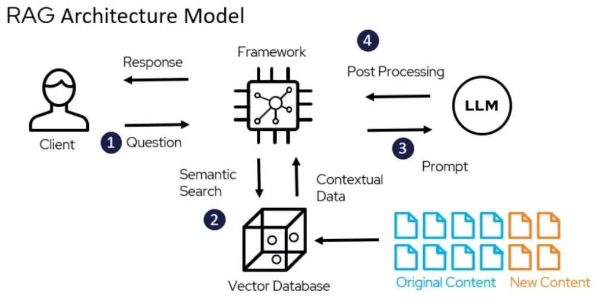

# Maritime Regulations RAG System 



## Overview

This repository contains the code and resources for a RAG system that vectors PDF files regarding maritime regulations. A RAG system can enchance a LLM by allowing it to storage external knowlegde sources, improving it's accuracy to your questions.

**Key Features:**

* **Document Loading:** Supports loading documents from various sources (e.g., PDF, text files, web pages).
* **Indexing and Retrieval:** Implements efficient indexing techniques (e.g., using vector databases like ChromaDB, FAISS) to retrieve relevant information from the knowledge base.
* **Generation with Language Models:** Leverages powerful language models (e.g., OpenAI GPT-3/4, Hugging Face Transformers) to generate responses conditioned on the retrieved context.
* **Customizable Pipelines:** Designed with modular components, allowing for easy customization of the document loading, indexing, retrieval, and generation stages.
* **[Optional: Add any other specific features of your project, e.g., specific data sources, evaluation metrics, UI, etc.]**

## Getting Started

These instructions will guide you on how to set up and run the RAG system on your local machine.

### Prerequisites

* **Python 3.7+**
* **pip** (Python package installer)
* Gemini API Key
* Anaconda prompt
* Must import the following:
* import os
* import fitz  # PyMuPDF
* from langchain_huggingface import HuggingFaceEmbeddings
* import chromadb
* import traceback
* from tqdm import tqdm  # For progress bars
* import gc  # Garbage collectio

### Installation


1.  Create a virtual environment (recommended):

    ```bash
    conda create --name <environment_name> python=3.9  # On Anaconda Prompt 
    ```

3.  Install the required dependencies # On Anaconda Prompt :

    ```bash
    conda install -c conda-forge pymupdf #Fitz
    ```
    ```bash
    pip install langchain-huggingface #HuggingFace Embeddings
    ```
    ```bash
    pip install chromadb #Chromadb
    ```
    ```bash
    pip install tqdm #tqdm
    ```

    **(Note:** Make sure you have a `requirements.txt` file listing all the necessary Python packages. You can generate one using `pip freeze > requirements.txt` after installing the dependencies.)

### Configuration

* **API Keys:** If your project uses external APIs (e.g., OpenAI), you might need to set up API keys as environment variables or in a configuration file. Refer to the specific documentation for those integrations.
* **Data Sources:** Configure the paths to your knowledge base documents or the connection details for your data sources.


    **(Example: Mention environment variables)**

    ```bash
    export OPENAI_API_KEY="your_openai_api_key_here"
    ```

    

